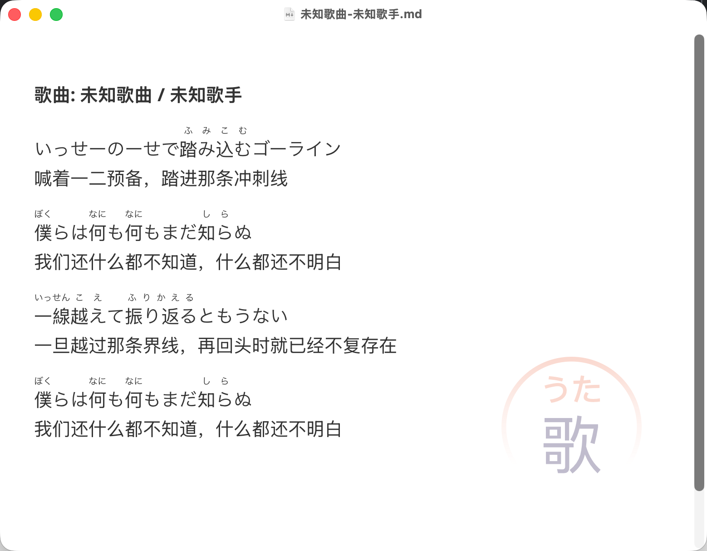
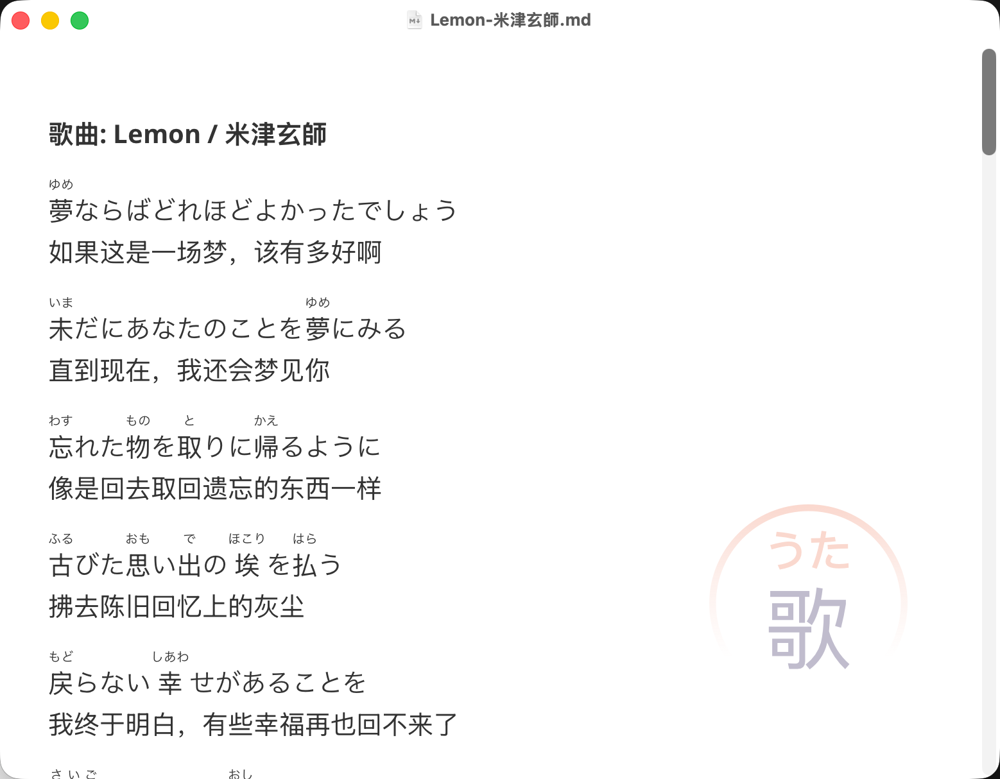
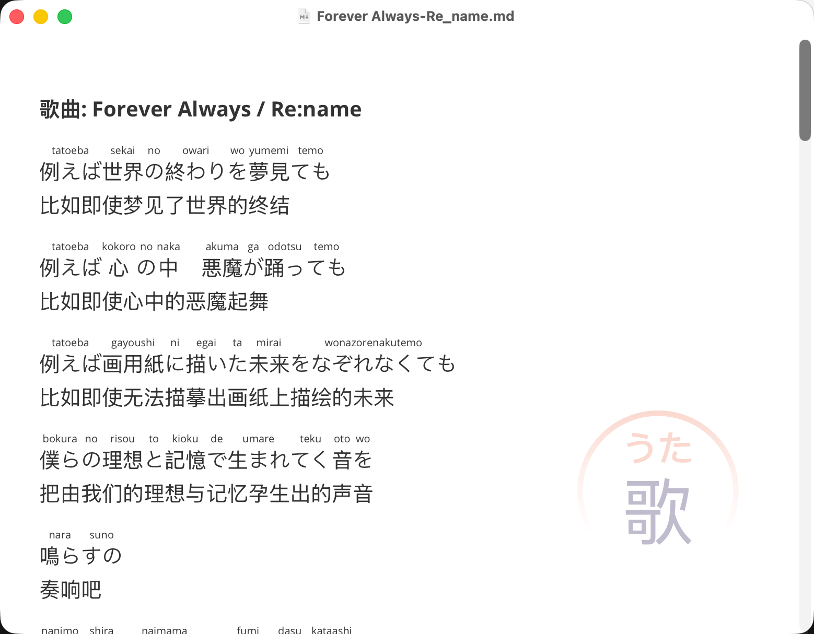

# utayomi (うたよみ) 🎵

`utayomi` 是一个专为 Agent 打造的日语歌词处理 Skill。

它巧妙地将**本地 Python 注音脚本的准确性**与 **Agent 的翻译排版能力**结合在一起。只需一句话，Agent 就能帮你抓取歌词、精准注音、逐句翻译，并最终生成一份排版精美的 Markdown 歌词文档，直接保存在你的本地电脑上！

输出示例：[text](output_example.md)

## ✨ 核心特性

- 🎯 **精准注音**：为日语歌词里的汉字自动补充 `<ruby>` 振假名，拒绝大模型猜测带来的多音字和送假名错误。
- 🔤 **两种模式**：支持原生**平假名标注模式**，也支持**罗马音标注模式**。
- 🐙 **灵活输入**：支持直接输入歌词文本，或提供歌词网页 URL。
- 🤖 **Agent 适配**：无缝挂载到 Claude Code、Codex 等 Agent 环境中长期使用。

*目前原生测试支持的歌词站点：[歌ネット (Uta-Net)](https://www.uta-net.com/)* *↗️ 和* *[J-Lyric.net](https://j-lyric.net/)* *↗️（如果有其他常用的，欢迎提 PR 补充！）*

## 💡 为什么不直接让大模型做？

大模型在翻译和排版方面表现出色，但在**日文汉字注音**上容易出现误差（如判断错多音字、送假名划分错误）。
`utayomi` 的核心价值在于合理的分工：

1. **Agent 负责基础工作**：抓取网页、清洗无关代码、逐句翻译成中文、整理 Markdown 格式并保存文件。
2. **本地脚本负责专业注音**：基于可靠的词典库进行精准的日文汉字注音。

最终，你得到的不仅是聊天窗口里的临时文字，而是一份可以直接使用 Obsidian、Typora 等工具打开的、排版精美的 `.md` 文件。

## 🚀 产出效果预览

生成出来的 `.md` 歌词文件不仅颜值高，而且信息全：

- **加粗标题**：醒目的歌名与歌手信息。
- **干净的排版**：日文歌词带 `<ruby>` 振假名或罗马音标注，下方紧跟一行信达雅的简体中文翻译。

文件会自动以 `{歌名}-{歌手名}.md` 命名。如果碰到重名文件，还会贴心地加上时间戳（如 `Lemon-米津玄師-202604191530.md`），绝不覆盖你的老文件。

## 🎮 使用方法

安装完成后，你可以通过以下方式给 Agent 下达指令：

### 方式 1：直接输入歌词

```text
utayomi 帮我处理下面这段歌词 ：
いっせーのーせで踏み込むゴーライン
僕らは何も何もまだ知らぬ
一線越えて振り返るともうない
僕らは何も何もまだ知らぬ
```

输出内容


*注：*
1. 默认情况下，系统使用**假名**进行标注。如需使用**罗马音**标注，请在指令中添加相关参数，例如：“`utayomi 用罗马音处理下面这段歌词...`”。
2. 如您输入的第一行信息为歌曲名与歌手信息，系统将以此作为生成的 Markdown 标题及文件名。

### 方式 2：提供歌词链接

```text
utayomi 帮我抓取并处理这首歌：
https://www.uta-net.com/song/244127/
```

输出内容


*注：此处同样可以添加参数使用罗马音，例如：“`utayomi 使用罗马音标注并处理这首歌：https://...`”*



## 📦 安装指南

### 🤖 自动安装

将以下提示词发送给你的 Agent，让它自动完成安装：

```text
请学习并访问 https://github.com/qweihu/Utayomi ，进行安装并激活为本地 skill，名称为 utayomi。如已安装并激活完成，请呈现一句接下来如何使用的引导说明文案。
```

### 🛠️ 手动安装

1. 从 [Releases 页面](https://github.com/qweihu/Utayomi/releases) 下载最新的 release 压缩包。
2. 将 release 包完整解压到你的 Agent 的 skill 目录下（注意：不要仅仅拷贝 `SKILL.md`，该 skill 依赖于目录中的其他脚本和文件）。
3. 在解压目录中安装运行依赖：

```bash
python3 -m pip install -r requirements.txt
```

4. 将解压后的 `SKILL.md` 注册并激活为本地 skill。

## 🌐 非 Agent 用户怎么办？

如果你不使用 Claude Code、Codex 等 Agent 环境，而是使用**网页端 LLM 工具**，或者像 **CherryStudio** 这样的本地客户端工具，同样可以使用本工具的降级方案：

1. 打开项目里的 [`PROMPT.md`](./PROMPT.md) 文件。
2. 把里面的提示词内容完整复制给大语言模型。
3. 然后再把需要处理的歌词正文或网页源码贴给它。

*注：这只是 Fallback 方案。要想获得最稳定、最准确的注音体验，依然推荐配置本地 Python 脚本环境。*

## 💻 CLI 命令行用法

脱离 Agent，核心脚本依然是个能打的命令行工具：

```bash
# 平假名模式
echo "夢ならばどれほどよかったでしょう" | python3 scripts/utayomi_core.py

# 罗马音模式
echo "夢ならばどれほどよかったでしょう" | python3 scripts/utayomi_core.py --romaji

# 从本地文件读取
python3 scripts/utayomi_core.py < lyrics.txt
```

*(注：CLI 仅负责输出注音结果，不包含翻译、排版和保存文件功能。这些属于 Agent 工作流。)*

## 📂 开发者与仓库说明

### 仓库结构与文件说明

```text
utayomi/
├── scripts/
│   └── utayomi_core.py    # 本地注音核心，只负责把输入文本转成带注音的结果
├── screenshot/            # README 配图目录
├── SKILL.md               # 给 Agent 读的工作流说明（抓歌词、调用脚本、排版并保存）
├── PROMPT.md              # 没有本地 skill / Python 环境时的网页端 fallback 提示词
├── requirements.txt       # 本地运行需要的 Python 依赖
├── package.json
├── LICENSE
└── README.md
```

### Release 包应该包含什么

为了保证 skill 能真正运行，release 包里至少要包含这些文件：

- `SKILL.md`
- `scripts/utayomi_core.py`
- `requirements.txt`
- `PROMPT.md`
- `README.md`
- `LICENSE`
- `package.json`

## 📜 License

MIT
